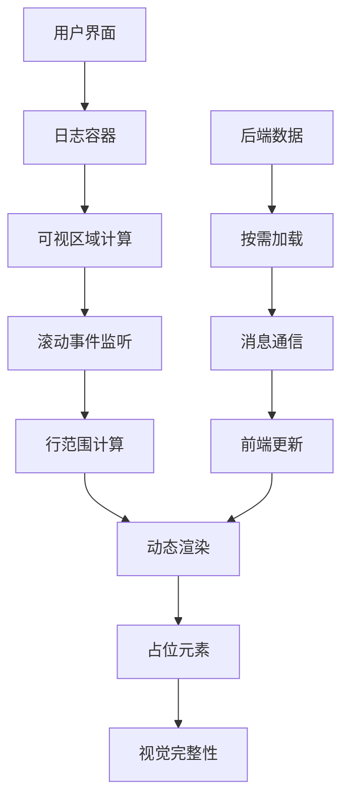
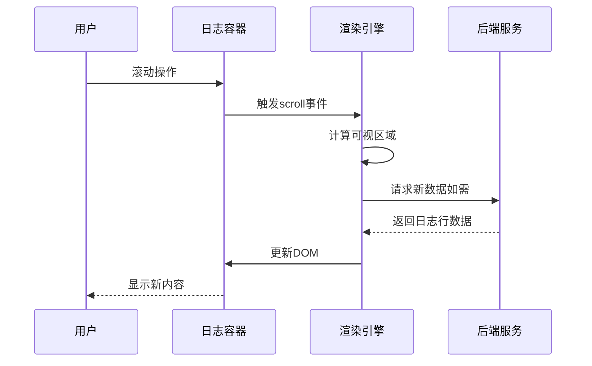
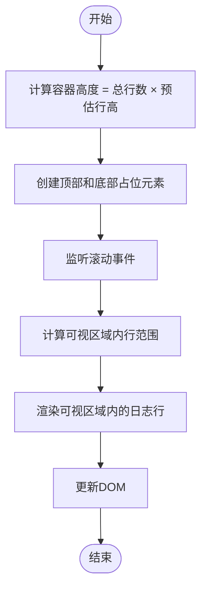

# 虚拟滚动

<cite>
**本文档中引用的文件**  
- [webview.html](file://src/webview.html)
- [logViewerPanel.ts](file://src/logViewerPanel.ts)
</cite>

## 目录
1. [简介](#简介)
2. [虚拟滚动架构](#虚拟滚动架构)
3. [核心实现机制](#核心实现机制)
4. [性能优化策略](#性能优化策略)
5. [结论](#结论)

## 简介

虚拟滚动技术是large_log_check扩展的核心功能，它使得GB级别的日志文件能够流畅浏览而不会导致内存溢出或界面卡顿。该技术通过只渲染可视区域内的日志行，动态加载和卸载内容，实现了高效的内存管理和快速响应的用户体验。本文档将深入解析虚拟滚动在webview.html和logViewerPanel.ts中的实现细节。

## 虚拟滚动架构

**Diagram sources**
- [webview.html](file://src/webview.html#L1313-L1422)
- [logViewerPanel.ts](file://src/logViewerPanel.ts#L54-L101)

## 核心实现机制

### 可视区域与滚动监听

虚拟滚动的核心在于监听滚动事件并计算当前可视区域。在webview.html中，通过监听`scroll`事件来触发`renderLines()`函数，该函数负责重新计算需要显示的日志行范围，并更新DOM。滚动位置的精确控制通过`scrollTop`属性实现，确保用户滚动时能准确反映其在日志文件中的位置。

**Diagram sources**
- [webview.html](file://src/webview.html#L3247-L3379)
- [logViewerPanel.ts](file://src/logViewerPanel.ts#L54-L101)

### 动态加载与卸载

在logViewerPanel.ts中，`loadMoreLines`方法处理来自前端的加载请求，通过`LogProcessor`读取指定范围的日志行，并通过`postMessage`发送回前端。前端接收到数据后，调用`renderLines()`进行渲染。这种按需加载机制有效降低了内存占用，避免了一次性加载整个大文件。

**Section sources**
- [logViewerPanel.ts](file://src/logViewerPanel.ts#L150-L163)
- [webview.html](file://src/webview.html#L1313-L1422)

### 容器尺寸与占位元素

虚拟滚动容器的尺寸计算依赖于预估的行高和总行数。通过设置容器的高度为`总行数 * 预估行高`，并使用占位元素填充不可见区域，保持了滚动条的正确比例和用户体验的一致性。当用户滚动时，实际渲染的只是当前可视区域内的少量日志行。

**Diagram sources**
- [webview.html](file://src/webview.html#L1313-L1422)

## 性能优化策略

### 行高估算与缓冲区

合理设置行高估算是保证滚动平滑的关键。过高的估算会导致滚动条过短，影响用户体验；过低则可能导致频繁重绘。同时，设置适当的缓冲区大小（即在可视区域上下额外渲染的行数），可以减少滚动时的闪烁和延迟，提升流畅度。

### 分页与懒加载

对于超大日志文件，采用分页加载策略。初始只加载前10000行，后续根据用户滚动动态加载更多数据。这种方式既保证了快速启动，又避免了内存过度消耗。`loadMoreData`函数在接近已加载数据末尾时自动触发，实现无缝的数据加载体验。

**Section sources**
- [webview.html](file://src/webview.html#L3216-L3228)
- [logViewerPanel.ts](file://src/logViewerPanel.ts#L124-L128)

## 结论

虚拟滚动技术在large_log_check中的应用，成功解决了大日志文件浏览的性能瓶颈。通过精确的可视区域计算、高效的动态加载机制和合理的性能优化策略，实现了GB级日志文件的流畅浏览。未来可进一步优化行高自适应算法和预加载策略，以提供更佳的用户体验。