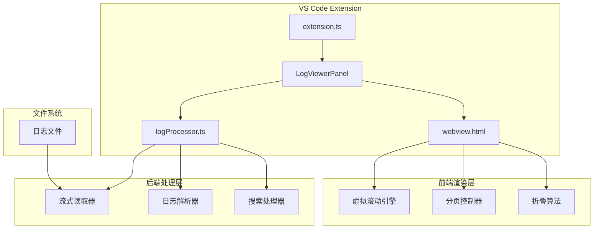
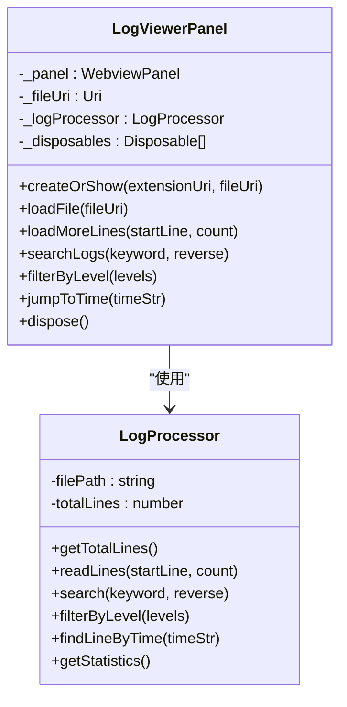
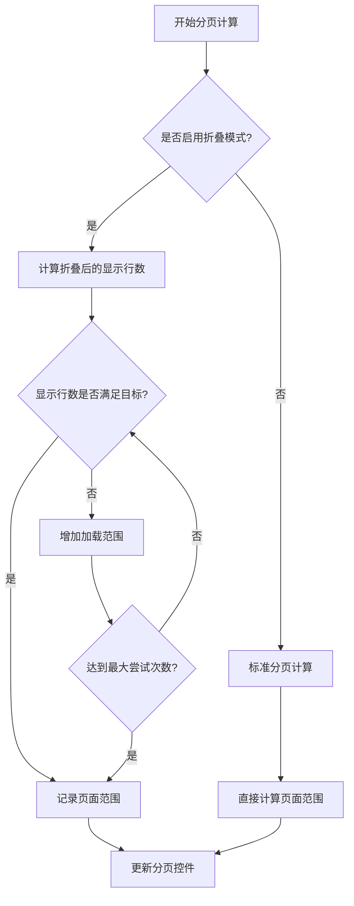
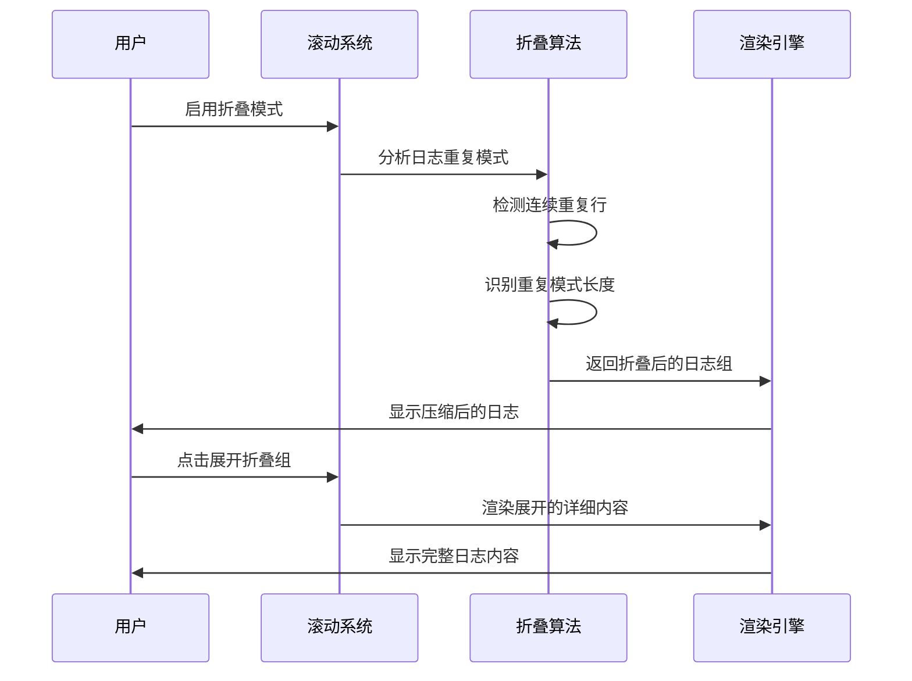
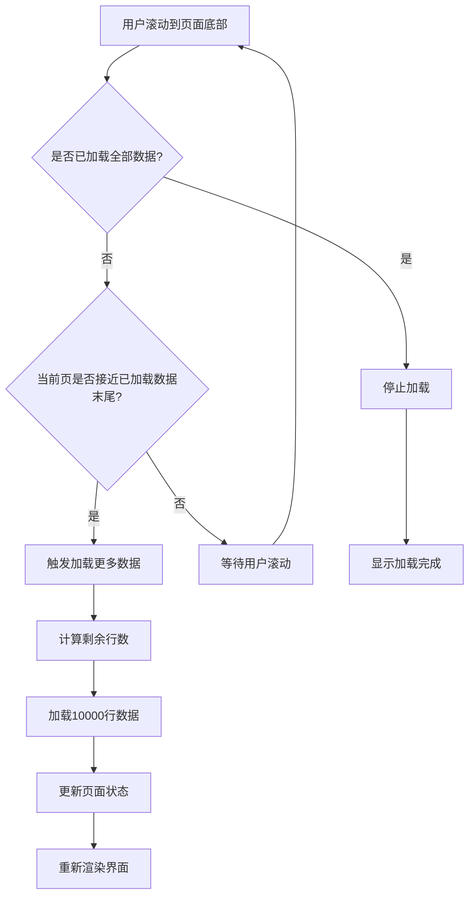

# 高性能加载

<cite>
**本文档引用的文件**
- [logViewerPanel.ts](file://src/logViewerPanel.ts)
- [logProcessor.ts](file://src/logProcessor.ts)
- [webview.html](file://src/webview.html)
- [extension.ts](file://src/extension.ts)
</cite>

## 目录
1. [简介](#简介)
2. [项目架构概览](#项目架构概览)
3. [核心组件分析](#核心组件分析)
4. [分页策略与加载机制](#分页策略与加载机制)
5. [虚拟滚动技术实现](#虚拟滚动技术实现)
6. [流式读取与性能优化](#流式读取与性能优化)
7. [滚动加载触发逻辑](#滚动加载触发逻辑)
8. [内存管理与资源优化](#内存管理与资源优化)
9. [性能优化建议](#性能优化建议)
10. [总结](#总结)

## 简介

large_log_check是一个专为VS Code设计的大规模日志文件查看器扩展，其核心优势在于能够秒级加载GB级日志文件。该项目通过创新的虚拟滚动技术和智能分页策略，实现了高性能的日志浏览体验，为开发者提供了流畅的大型日志文件处理能力。

## 项目架构概览

项目采用前后端分离的架构设计，主要由以下核心模块组成：



**图表来源**
- [extension.ts](file://src/extension.ts#L1-L116)
- [logViewerPanel.ts](file://src/logViewerPanel.ts#L1-L510)
- [logProcessor.ts](file://src/logProcessor.ts#L1-L807)

## 核心组件分析

### LogViewerPanel - 主面板控制器

LogViewerPanel是整个系统的协调中心，负责管理日志文件的加载、显示和交互逻辑。



**图表来源**
- [logViewerPanel.ts](file://src/logViewerPanel.ts#L6-L510)
- [logProcessor.ts](file://src/logProcessor.ts#L30-L807)

**章节来源**
- [logViewerPanel.ts](file://src/logViewerPanel.ts#L1-L510)
- [logProcessor.ts](file://src/logProcessor.ts#L1-L807)

### webview.html - 前端渲染引擎

前端采用现代化的HTML5和JavaScript技术栈，实现了高度优化的虚拟滚动和交互界面。

**章节来源**
- [webview.html](file://src/webview.html#L1-L4092)

## 分页策略与加载机制

### 文件大小阈值判断

系统根据文件大小智能选择加载策略，这是性能优化的关键决策点：

```typescript
// 分页策略实现
if (totalLines <= 50000) {
    // 小于5万行，一次性加载所有数据
    vscode.window.showInformationMessage(`正在加载 ${totalLines} 行日志，请稍候...`);
    initialLines = await this._logProcessor.readLines(0, totalLines);
} else {
    // 大于5万行，先加载前10000行
    vscode.window.showInformationMessage(`文件较大，先加载前 10000 行...`);
    initialLines = await this._logProcessor.readLines(0, 10000);
}
```

这种策略的优势：
- **小文件优化**：5万行以下的文件采用全量加载，提供最佳的搜索和过滤体验
- **大文件保护**：超过5万行的文件采用懒加载，避免内存溢出
- **用户体验**：立即显示前10000行，让用户感知到系统响应

### 动态分页计算

系统实现了智能的分页算法，能够根据内容复杂度动态调整加载策略：



**图表来源**
- [webview.html](file://src/webview.html#L1327-L1422)

**章节来源**
- [logViewerPanel.ts](file://src/logViewerPanel.ts#L107-L147)

## 虚拟滚动技术实现

### 可视区域渲染机制

虚拟滚动是系统性能的核心保障，通过只渲染可视区域内的日志行来大幅降低内存占用：

```javascript
function renderLines() {
    const container = document.getElementById('logContainer');
    container.innerHTML = '';
    
    // 计算当前页面的起始和结束索引
    const startIndex = (currentPage - 1) * pageSize;
    const endIndex = Math.min(startIndex + pageSize, allLines.length);
    
    // 只渲染可视区域内的日志行
    const pageLines = allLines.slice(startIndex, endIndex);
    
    pageLines.forEach((line, index) => {
        renderSingleLine(container, line, startIndex, index);
    });
}
```

### 折叠模式下的智能加载

系统支持高级的折叠模式，能够智能识别重复日志并进行压缩显示：



**图表来源**
- [webview.html](file://src/webview.html#L1651-L1726)

**章节来源**
- [webview.html](file://src/webview.html#L1313-L1422)

## 流式读取与性能优化

### ReadLine方法的流式实现

LogProcessor的readLines方法采用了高效的流式读取策略：

```typescript
async readLines(startLine: number, count: number): Promise<LogLine[]> {
    return new Promise((resolve, reject) => {
        const lines: LogLine[] = [];
        let currentLine = 0;
        const endLine = startLine + count;

        const stream = fs.createReadStream(this.filePath);
        const rl = readline.createInterface({
            input: stream,
            crlfDelay: Infinity
        });

        rl.on('line', (line) => {
            if (currentLine >= startLine && currentLine < endLine) {
                const timestamp = this.extractTimestamp(line);
                const level = this.extractLogLevel(line);
                lines.push({
                    lineNumber: currentLine + 1,
                    content: line,
                    timestamp: timestamp,
                    level: level
                });
            }
            currentLine++;
            
            // 如果已经读取了足够的行,关闭流
            if (currentLine >= endLine) {
                rl.close();
                stream.destroy();
            }
        });

        rl.on('close', () => {
            resolve(lines);
        });

        rl.on('error', (error) => {
            reject(error);
        });
    });
}
```

### 关键性能优化点

1. **流式处理**：使用Node.js的readline模块逐行读取，避免一次性加载整个文件
2. **条件读取**：只读取指定范围的行，跳过不需要的部分
3. **及时释放**：读取完成后立即关闭流和销毁资源
4. **内存控制**：限制同时加载的行数，防止内存溢出

**章节来源**
- [logProcessor.ts](file://src/logProcessor.ts#L90-L129)

## 滚动加载触发逻辑

### 自动加载机制

系统实现了智能的滚动加载触发机制，当用户接近页面底部时自动加载更多数据：



**图表来源**
- [webview.html](file://src/webview.html#L3200-L3214)

### 分页加载策略

系统支持多种分页加载方式：

1. **手动翻页**：用户主动点击翻页按钮
2. **滚动触发**：自动检测滚动位置并加载
3. **全量加载**：一次性加载剩余所有数据
4. **智能预测**：基于历史数据预测加载策略

**章节来源**
- [webview.html](file://src/webview.html#L3216-L3269)

## 内存管理与资源优化

### 页面范围缓存机制

为了避免重复计算页面范围，系统实现了智能的缓存机制：

```javascript
let pageRanges = new Map(); // 记录每页实际加载的行范围

// 检查是否需要重新计算页面范围
if (isCollapseMode && !pageRanges.has(currentPage)) {
    // 从已知范围开始计算
    calculatePageRange(currentPage);
}
```

### 资源清理策略

1. **及时释放**：滚动离开的页面内容会被清理
2. **内存监控**：定期检查内存使用情况
3. **垃圾回收**：主动触发JavaScript垃圾回收
4. **资源池化**：重用DOM元素和样式对象

**章节来源**
- [webview.html](file://src/webview.html#L1176-L1177)

## 性能优化建议

### 合理设置每页行数

根据不同的使用场景，推荐以下页面大小配置：

| 场景类型 | 推荐页面大小 | 内存占用 | 响应速度 | 适用文件大小 |
|---------|-------------|----------|----------|-------------|
| 日常开发 | 100-200行 | 中等 | 快速 | <100万行 |
| 性能分析 | 500-1000行 | 较高 | 中等 | 100万-500万行 |
| 大规模分析 | 2000-5000行 | 高 | 较慢 | >500万行 |

### 折叠模式使用指南

折叠模式在处理大量重复日志时效果显著：

```javascript
// 启用折叠模式的最佳实践
function optimizeForLargeLogs() {
    // 1. 启用折叠模式
    document.getElementById('collapseRepeated').checked = true;
    
    // 2. 选择合适的页面大小
    document.getElementById('pageSizeSelect').value = '500';
    
    // 3. 禁用不必要的功能
    document.getElementById('enableJsonParse').checked = false;
    
    // 4. 限制高亮规则数量
    customHighlightRules = customHighlightRules.slice(0, 5);
}
```

### 网络和I/O优化

1. **本地文件访问**：优先处理本地文件，避免网络延迟
2. **批量读取**：每次读取固定数量的行，减少I/O次数
3. **预读机制**：提前读取用户可能访问的页面内容
4. **压缩处理**：对压缩格式的日志文件进行特殊处理

### 前端渲染优化

1. **虚拟DOM**：使用轻量级的虚拟DOM库
2. **事件委托**：对大量日志行使用事件委托
3. **CSS优化**：避免复杂的CSS选择器
4. **图片懒加载**：对日志中的图片内容进行懒加载

## 总结

large_log_check通过以下核心技术实现了高性能的日志文件加载：

1. **智能分页策略**：根据文件大小自动选择加载方式
2. **虚拟滚动技术**：只渲染可视区域内容，大幅降低内存占用
3. **流式读取机制**：高效处理大文件，避免内存溢出
4. **折叠算法**：智能识别重复内容，提供更好的浏览体验
5. **缓存机制**：智能缓存页面范围，提高翻页响应速度

这套解决方案不仅适用于日志文件处理，也为其他大规模数据可视化应用提供了宝贵的参考经验。通过合理的架构设计和性能优化，即使是GB级的数据也能实现秒级加载和流畅浏览。