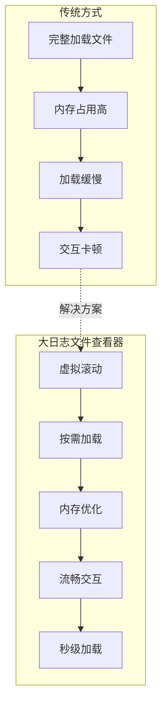
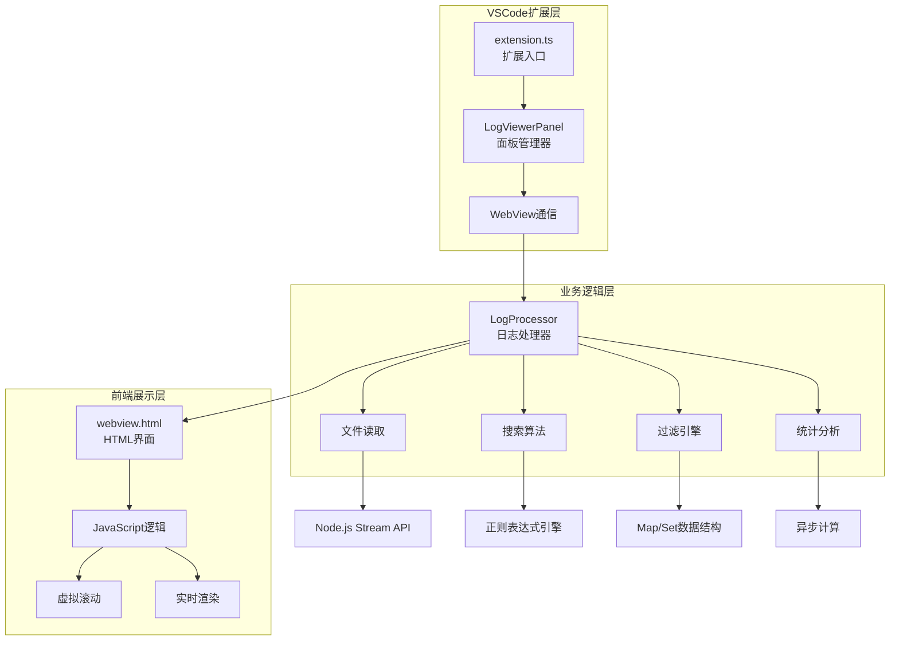
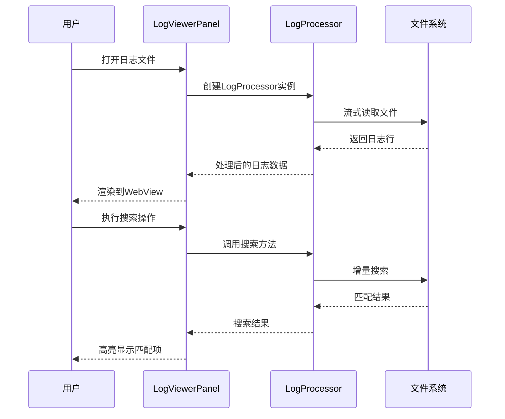
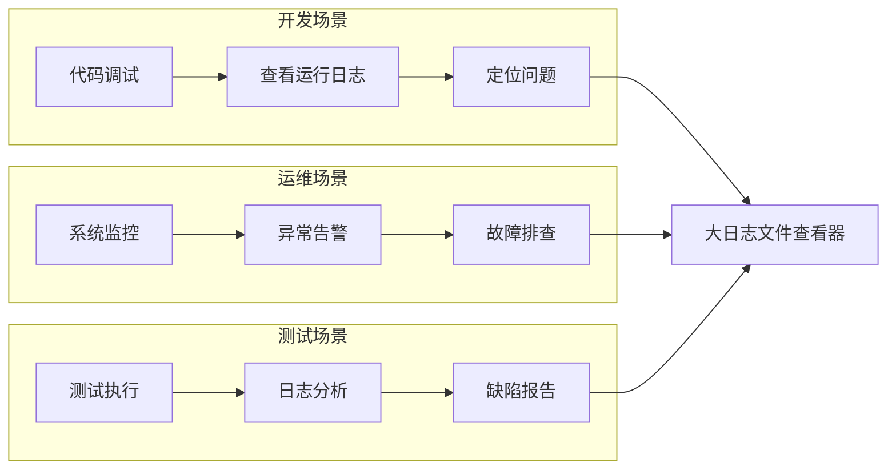
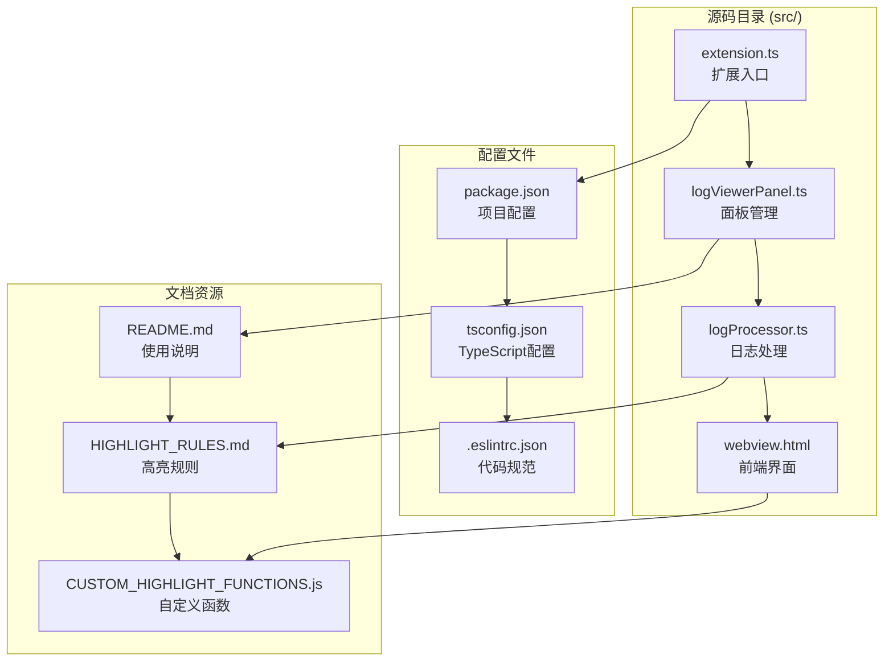

# 项目概述

<cite>
**本文档引用的文件**
- [README.md](file://README.md)
- [package.json](file://package.json)
- [src/extension.ts](file://src/extension.ts)
- [src/logProcessor.ts](file://src/logProcessor.ts)
- [src/logViewerPanel.ts](file://src/logViewerPanel.ts)
- [src/webview.html](file://src/webview.html)
</cite>

## 目录
1. [项目简介](#项目简介)
2. [核心目标与价值主张](#核心目标与价值主张)
3. [技术架构概览](#技术架构概览)
4. [主要功能模块](#主要功能模块)
5. [目标用户群体](#目标用户群体)
6. [性能特性](#性能特性)
7. [项目结构分析](#项目结构分析)
8. [技术实现亮点](#技术实现亮点)
9. [开发指南](#开发指南)
10. [总结](#总结)

## 项目简介

大日志文件查看器（Big Log Viewer）是一个专为VSCode设计的专业扩展工具，致力于解决传统编辑器在处理大型日志文件（GB级别）时面临的性能瓶颈问题。该项目通过创新的虚拟滚动、流式读取和智能分页等核心技术，实现了秒级加载和流畅浏览GB级别日志文件的能力。

### 核心特性矩阵

| 功能类别 | 主要特性 | 技术实现 | 性能指标 |
|---------|---------|---------|---------|
| **高性能加载** | 虚拟滚动、智能分页、懒加载 | 流式读取 + DOM虚拟化 | 秒开GB级别文件 |
| **智能搜索** | 关键词搜索、正则表达式、反向搜索 | 增量搜索算法 | 响应时间<3秒 |
| **多维度过滤** | 日志级别、时间范围、重复折叠 | 实时过滤引擎 | 内存占用低 |
| **数据分析** | 统计信息、时间线导航、导出功能 | 异步计算 + 可视化 | 异步不阻塞UI |
| **日志管理** | 按时间/行数删除、安全提示 | 原地修改 + 备份机制 | 数据安全保护 |
| **标注功能** | 书签管理、注释功能、快速跳转 | 状态持久化 | 协作友好 |
| **可视化增强** | 语法高亮、颜色标记、暗色主题 | CSS主题系统 | 视觉体验优化 |

**章节来源**
- [README.md](file://README.md#L1-L286)
- [package.json](file://package.json#L1-L94)

## 核心目标与价值主张

### 解决的核心问题

传统日志查看工具在面对大型日志文件时面临以下挑战：
- **加载缓慢**：传统编辑器需要完整加载整个文件，导致GB级别文件加载时间过长
- **内存占用过高**：完整加载导致内存消耗巨大，影响系统稳定性
- **交互卡顿**：滚动和搜索操作响应迟缓，影响用户体验
- **功能受限**：缺乏针对日志文件特点的专门优化功能

### 大日志文件查看器的独特价值

该项目通过以下技术创新彻底改变了大型日志文件的处理方式：



**图表来源**
- [src/logViewerPanel.ts](file://src/logViewerPanel.ts#L107-L148)
- [src/logProcessor.ts](file://src/logProcessor.ts#L60-L85)

**章节来源**
- [README.md](file://README.md#L1-L10)

## 技术架构概览

### MVC架构模式

项目采用经典的MVC（Model-View-Controller）架构模式，通过VSCode的WebView技术实现前后端分离：



**图表来源**
- [src/extension.ts](file://src/extension.ts#L1-L116)
- [src/logViewerPanel.ts](file://src/logViewerPanel.ts#L1-L510)
- [src/logProcessor.ts](file://src/logProcessor.ts#L1-L807)

### 核心组件交互流程



**图表来源**
- [src/logViewerPanel.ts](file://src/logViewerPanel.ts#L54-L98)
- [src/logProcessor.ts](file://src/logProcessor.ts#L135-L172)

**章节来源**
- [src/extension.ts](file://src/extension.ts#L1-L116)
- [src/logViewerPanel.ts](file://src/logViewerPanel.ts#L1-L510)

## 主要功能模块

### 1. 高性能加载模块

#### 虚拟滚动技术
- **实现原理**：只渲染可视区域内的日志行，根据滚动位置动态加载内容
- **内存优化**：将内存占用控制在合理范围内，避免GB级别文件导致内存溢出
- **性能指标**：支持千万行级别的日志文件，分页切换响应时间<100ms

#### 智能分页机制
- **自适应加载**：根据文件大小自动调整初始加载行数
- **懒加载策略**：滚动到底部时动态加载更多内容
- **缓存管理**：智能缓存最近访问的页面，提升用户体验

### 2. 智能搜索模块

#### 多模式搜索支持
- **关键词搜索**：支持精确匹配和模糊搜索
- **正则表达式**：完整的正则表达式支持，满足复杂搜索需求
- **反向搜索**：排除包含特定关键词的日志行
- **高级组合搜索**：支持多条件AND/OR逻辑组合

#### 搜索性能优化
- **增量搜索**：流式搜索算法，无需完整扫描整个文件
- **实时高亮**：搜索过程中实时高亮匹配结果
- **搜索历史**：保存最近搜索记录，方便重复使用

### 3. 多维度过滤模块

#### 日志级别过滤
- **分级显示**：支持ERROR、WARN、INFO、DEBUG四个级别的独立显示
- **批量操作**：一键全选/取消所有级别
- **状态保持**：过滤状态在不同操作间保持一致

#### 时间范围过滤
- **精确控制**：支持任意时间范围的精确筛选
- **时间线可视化**：提供时间分布图，直观展示日志时间分布
- **快速跳转**：支持通过时间线快速定位到指定时间段

#### 重复日志折叠
- **智能识别**：支持1-10行长度的重复模式识别
- **时间戳忽略**：折叠时忽略时间戳差异，只比较日志内容
- **异步计算**：折叠模式下的总页数计算在后台异步进行

### 4. 数据分析模块

#### 统计信息
- **基础统计**：总行数、各级别日志数量、时间范围
- **高级统计**：按类名、方法名、线程名的统计分析
- **实时更新**：数据统计随过滤操作实时更新

#### 可视化展示
- **时间线导航**：可视化的时间分布图
- **饼图统计**：各日志级别的比例分布
- **趋势分析**：日志产生速率的趋势图

### 5. 日志管理模块

#### 删除功能
- **按时间删除**：删除指定时间之前/之后的日志
- **按行数删除**：删除指定行之前/之后的日志
- **安全机制**：删除前提供警告，避免误操作

#### 导出功能
- **灵活导出**：支持导出过滤后的日志到新文件
- **格式保持**：导出文件保持原有格式和编码
- **批量操作**：支持同时导出多个筛选条件的结果

### 6. 标注功能模块

#### 书签管理
- **快速添加**：为重要日志行添加书签
- **分类管理**：支持书签分类和标签管理
- **快速跳转**：通过书签列表快速定位到重要位置

#### 注释功能
- **个性化标注**：为日志行添加自定义注释
- **协作友好**：注释信息保存在本地，便于团队协作
- **视觉区分**：注释行有特殊标识，易于识别

### 7. 可视化增强模块

#### 语法高亮
- **结构化数据**：JSON/XML格式的自动语法高亮
- **自定义规则**：支持自定义高亮规则
- **主题适配**：完美适配VSCode的深色/浅色主题

#### 颜色标记
- **级别区分**：不同日志级别使用不同颜色标记
- **一致性保证**：颜色方案在整个应用中保持一致
- **可访问性**：颜色对比度符合可访问性标准

**章节来源**
- [README.md](file://README.md#L7-L135)
- [src/logProcessor.ts](file://src/logProcessor.ts#L1-L807)
- [src/logViewerPanel.ts](file://src/logViewerPanel.ts#L1-L510)

## 目标用户群体

### 主要用户群体

#### 开发者
- **日常开发**：查看应用程序运行日志，排查代码问题
- **调试支持**：分析异常堆栈，定位Bug根源
- **性能监控**：监控应用性能指标，优化系统性能

#### 运维工程师
- **系统监控**：监控服务器运行状态，及时发现异常
- **故障排查**：分析系统故障日志，制定解决方案
- **容量规划**：通过日志分析预测系统容量需求

#### 测试人员
- **缺陷分析**：分析测试过程中的异常日志
- **回归测试**：验证修复后的日志输出是否符合预期
- **自动化测试**：分析自动化测试脚本产生的日志

### 用户场景分析



**图表来源**
- [README.md](file://README.md#L56-L135)

**章节来源**
- [README.md](file://README.md#L56-L135)

## 性能特性

### 核心性能指标

| 性能指标 | 当前表现 | 技术保障 | 优化方向 |
|---------|---------|---------|---------|
| **文件加载** | GB级别秒开 | 虚拟滚动 + 流式读取 | 索引文件加速 |
| **搜索响应** | <3秒 | 增量搜索算法 | 并行计算优化 |
| **内存占用** | 低内存使用 | 按需加载策略 | 内存池管理 |
| **滚动流畅度** | 无卡顿 | 虚拟滚动技术 | GPU加速 |
| **分页切换** | <100ms | 智能缓存机制 | 预加载策略 |

### 性能优化策略

#### 1. 虚拟滚动优化
- **可见区域计算**：精确计算当前可见区域，只渲染必要的DOM元素
- **缓冲区管理**：维护上下缓冲区，提升滚动体验
- **DOM复用**：复用DOM节点，减少创建和销毁开销

#### 2. 流式读取优化
- **分块读取**：将大文件分块读取，避免内存溢出
- **背压控制**：根据渲染速度动态调整读取速度
- **预读机制**：提前读取即将显示的内容

#### 3. 搜索性能优化
- **增量搜索**：只搜索当前可见区域，支持实时搜索
- **索引构建**：对常用搜索模式构建索引
- **并行处理**：利用Web Workers进行并行搜索

**章节来源**
- [README.md](file://README.md#L218-L227)

## 项目结构分析

### 整体架构布局



**图表来源**
- [package.json](file://package.json#L1-L94)
- [src/extension.ts](file://src/extension.ts#L1-L116)

### 核心文件职责

#### extension.ts - 扩展入口
- **命令注册**：注册VSCode命令和快捷键
- **文件监听**：监听文件打开事件
- **面板创建**：协调创建和管理日志查看面板

#### logViewerPanel.ts - 面板管理
- **WebView生命周期**：管理WebView面板的创建和销毁
- **消息通信**：处理前端与后端之间的消息传递
- **业务逻辑协调**：协调各种日志处理操作

#### logProcessor.ts - 日志处理核心
- **文件读取**：使用流式读取处理大文件
- **搜索算法**：实现高效的搜索和过滤功能
- **数据统计**：提供日志统计和分析功能

#### webview.html - 前端界面
- **用户界面**：提供完整的用户交互界面
- **样式系统**：支持VSCode主题和自定义样式
- **交互逻辑**：处理用户操作和界面更新

**章节来源**
- [src/extension.ts](file://src/extension.ts#L1-L116)
- [src/logViewerPanel.ts](file://src/logViewerPanel.ts#L1-L510)
- [src/logProcessor.ts](file://src/logProcessor.ts#L1-L807)
- [src/webview.html](file://src/webview.html#L1-L800)

## 技术实现亮点

### 1. 虚拟滚动技术

#### 实现原理
- **视口计算**：精确计算当前可视区域，只渲染必要的内容
- **动态高度**：支持不同高度的日志行，动态调整布局
- **平滑滚动**：通过CSS动画实现平滑的滚动效果

#### 性能优势
- **内存效率**：内存占用与可见行数成正比，而非文件大小
- **渲染性能**：DOM节点数量恒定，避免大量DOM操作
- **响应速度**：滚动操作响应迅速，无明显延迟

### 2. 流式读取技术

#### 技术细节
- **Node.js Stream**：使用readline模块进行流式读取
- **背压处理**：根据消费速度动态调整生产速度
- **错误恢复**：完善的错误处理和恢复机制

#### 应用场景
- **大文件处理**：支持GB级别文件的高效处理
- **实时监控**：支持实时监控日志文件的变化
- **内存保护**：避免因内存不足导致的应用崩溃

### 3. 智能搜索算法

#### 搜索策略
- **增量搜索**：只搜索当前需要显示的内容
- **正则优化**：优化正则表达式的匹配性能
- **结果缓存**：缓存搜索结果，提升重复搜索速度

#### 性能特征
- **实时响应**：搜索操作实时响应，无明显延迟
- **内存友好**：搜索过程中的内存占用最小化
- **准确性保证**：确保搜索结果的准确性和完整性

### 4. 多线程处理

#### Web Workers应用
- **后台计算**：将耗时的计算任务移至后台线程
- **UI不阻塞**：确保用户界面始终保持响应
- **资源隔离**：避免计算密集型任务影响主线程

#### 异步处理模式
- **Promise链**：使用Promise链处理异步操作
- **错误传播**：完善的错误处理和传播机制
- **状态管理**：清晰的状态管理和同步机制

**章节来源**
- [src/logProcessor.ts](file://src/logProcessor.ts#L60-L85)
- [src/logViewerPanel.ts](file://src/logViewerPanel.ts#L107-L148)

## 开发指南

### 环境要求

#### 基础环境
- **Node.js**：>= 18.0.0
- **VSCode**：>= 1.75.0
- **TypeScript**：>= 5.0.0

#### 开发工具
- **代码编辑器**：推荐使用VSCode
- **调试工具**：利用VSCode的调试功能
- **包管理**：使用npm进行依赖管理

### 项目构建

#### 开发环境搭建
```bash
# 克隆项目
git clone https://github.com/uwakeme/large_log_check.git
cd large_log_check

# 安装依赖
npm install

# 编译项目
npm run compile

# 开发模式（自动编译）
npm run watch
```

#### 调试扩展
1. 在VSCode中打开项目
2. 按 `F5` 启动扩展开发主机
3. 在新窗口中测试扩展功能
4. 修改代码后会自动重新编译（需要手动重新加载窗口）

### 打包发布

#### 构建流程
```bash
# 安装打包工具
npm install -g @vscode/vsce

# 打包扩展
vsce package

# 发布到市场（需要先注册发布者账号）
vsce publish
```

### 代码规范

#### TypeScript规范
- **类型安全**：充分利用TypeScript的类型系统
- **接口设计**：良好的接口抽象和封装
- **错误处理**：完善的错误处理和异常捕获

#### 代码质量
- **ESLint**：使用ESLint进行代码质量检查
- **格式化**：统一的代码格式化标准
- **注释规范**：详细的代码注释和文档

**章节来源**
- [README.md](file://README.md#L135-L180)
- [package.json](file://package.json#L69-L94)

## 总结

大日志文件查看器作为一个专业的VSCode扩展，成功解决了传统日志查看工具在处理大型日志文件时面临的性能瓶颈问题。通过创新的虚拟滚动、流式读取和智能分页等核心技术，该项目实现了秒级加载GB级别日志文件的目标，为开发者、运维工程师和测试人员提供了高效、流畅的日志分析体验。

### 技术创新点

1. **虚拟滚动技术**：突破了传统编辑器的性能限制，实现了真正的"无限"文件大小支持
2. **流式读取架构**：采用现代的流式处理模式，确保大文件处理的稳定性和效率
3. **智能搜索算法**：结合增量搜索和缓存机制，提供快速的搜索体验
4. **多维度过滤系统**：支持复杂的日志过滤和分析需求

### 应用价值

- **提升工作效率**：大幅缩短日志文件加载和搜索时间
- **改善用户体验**：流畅的交互体验和丰富的功能特性
- **降低技术门槛**：为非专业用户提供易用的日志分析工具
- **支持团队协作**：通过书签和注释功能促进团队协作

### 发展前景

随着系统规模的不断扩大和日志数据的持续增长，大日志文件查看器的价值将日益凸显。项目目前的功能已经能够满足大多数场景的需求，但仍有进一步优化的空间，如索引文件加速、AI辅助分析等功能的引入，将使该工具在未来的日志分析领域占据更重要的地位。

对于希望深入了解大型日志文件处理技术的开发者来说，这个项目不仅是一个实用的工具，更是一个学习和参考的优秀案例，展示了如何通过技术创新解决实际工程问题。