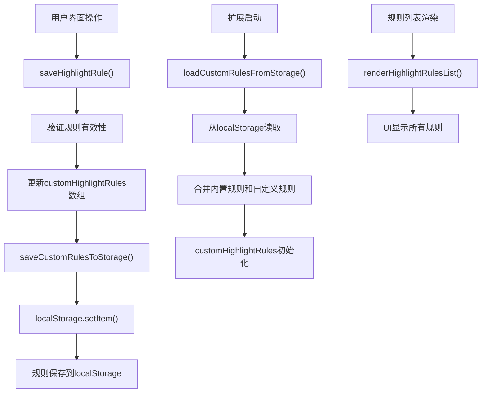
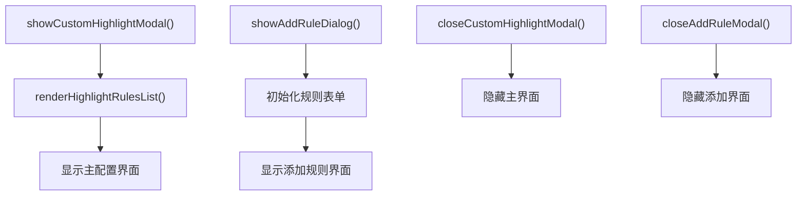

# 高级功能

<cite>
**本文档引用的文件**
- [HIGHLIGHT_RULES.md](file://HIGHLIGHT_RULES.md)
- [CUSTOM_HIGHLIGHT_FUNCTIONS.js](file://CUSTOM_HIGHLIGHT_FUNCTIONS.js)
- [src/webview.html](file://src/webview.html)
- [src/logViewerPanel.ts](file://src/logViewerPanel.ts)
</cite>

## 目录
1. [简介](#简介)
2. [内置高亮规则](#内置高亮规则)
3. [自定义高亮规则](#自定义高亮规则)
4. [规则持久化机制](#规则持久化机制)
5. [规则应用顺序](#规则应用顺序)
6. [正则表达式示例](#正则表达式示例)
7. [性能优化建议](#性能优化建议)
8. [可访问性考虑](#可访问性考虑)
9. [CUSTOM_HIGHLIGHT_FUNCTIONS.js详解](#custom_highlight_functionsjs详解)
10. [故障排除指南](#故障排除指南)

## 简介

大型日志检查扩展提供了强大的自定义高亮规则功能，允许用户根据特定需求定制日志内容的视觉呈现。该功能结合了内置规则的强大基础和用户自定义规则的灵活性，为日志分析提供了前所未有的可视化体验。

## 内置高亮规则

扩展预设了8个经过精心设计的内置高亮规则，这些规则自动启用，涵盖了最常见的日志元素。

### 规则配置表

| 规则名称 | 匹配模式 | 颜色 | 说明 |
|---------|---------|------|------|
| 日志级别 - ERROR | `\b(ERROR\|FATAL\|SEVERE)\b` | 红色 (#f14c4c) | 错误级别日志 |
| 日志级别 - WARN | `\b(WARN\|WARNING)\b` | 黄色 (#cca700) | 警告级别日志 |
| 日志级别 - INFO | `\b(INFO)\b` | 蓝色 (#4fc1ff) | 信息级别日志 |
| 日志级别 - DEBUG | `\b(DEBUG\|TRACE\|VERBOSE)\b` | 紫色 (#b267e6) | 调试级别日志 |
| 时间戳 | `\d{4}[-/]\d{2}[-/]\d{2}[T\s]\d{2}:\d{2}:\d{2}(\.\d+)?` | 紫色 (#b267e6) | 时间戳格式 |
| 线程名 | `\[([a-zA-Z][a-zA-Z0-9-_]*)\]` | 青色 (#06b6d4) | 线程名称 |
| 类名 | `\b([a-z][a-z0-9_]*(?:\.[a-z][a-z0-9_]*)*\.[A-Z][a-zA-Z0-9_]*)\b` | 绿色 (#10b981) | Java类全限定名 |
| 方法名 | `\b([a-z][a-zA-Z0-9_]+):(\d+)\b` | 橙色 (#f59e0b) | 方法名:行号格式 |

### 内置规则特点

- **不可删除**：内置规则不能被删除，但可以禁用
- **自动启用**：所有内置规则默认处于启用状态
- **性能优化**：每个规则都经过优化的正则表达式设计
- **广泛覆盖**：涵盖Java、Python、JavaScript等主流语言的日志格式

**节源**
- [HIGHLIGHT_RULES.md](file://HIGHLIGHT_RULES.md#L10-L27)

## 自定义高亮规则

用户可以通过直观的界面添加、编辑和管理自定义高亮规则，满足特定项目的个性化需求。

### 匹配模式类型

#### 文本匹配
- **简单字符串**：适用于固定的关键词匹配
- **示例**：`API`、`timeout`、`success`
- **特点**：性能优异，适合简单场景

#### 正则表达式匹配
- **灵活模式**：支持复杂的模式匹配
- **示例**：`\b\w+Exception\b` 匹配所有异常类
- **特点**：功能强大，适合复杂场景

### 颜色自定义系统

#### 配色方案
- **背景色**：使用颜色选择器选择任意颜色
- **文字色**：确保与背景色有足够的对比度
- **实时预览**：即时查看颜色效果

#### 推荐配色方案

| 状态 | 背景色 | 文字色 | 用途 |
|------|--------|--------|------|
| 错误/危险 | `#dc2626` | `#ffffff` | 严重错误和异常 |
| 警告 | `#f59e0b` | `#ffffff` | 警告信息 |
| 成功 | `#10b981` | `#ffffff` | 操作成功 |
| 信息 | `#3b82f6` | `#ffffff` | 一般信息 |
| 高亮/重要 | `#8b5cf6` | `#ffffff` | 关键信息 |
| 次要信息 | `#6b7280` | `#ffffff` | 辅助信息 |

### 规则管理功能

#### 基本操作
- **添加规则**：点击"➕ 添加新规则"按钮
- **编辑规则**：点击规则项旁的"编辑"按钮
- **删除规则**：点击规则项旁的"删除"按钮
- **启用/禁用**：切换规则前的复选框

#### 高级功能
- **重置规则**：一键恢复到默认内置规则
- **批量操作**：支持同时启用/禁用多个规则

**节源**
- [HIGHLIGHT_RULES.md](file://HIGHLIGHT_RULES.md#L28-L91)
- [CUSTOM_HIGHLIGHT_FUNCTIONS.js](file://CUSTOM_HIGHLIGHT_FUNCTIONS.js#L15-L138)

## 规则持久化机制

高亮规则采用localStorage进行本地存储，确保用户的个性化设置能够跨会话保持。

### 存储架构



**图表源**
- [CUSTOM_HIGHLIGHT_FUNCTIONS.js](file://CUSTOM_HIGHLIGHT_FUNCTIONS.js#L34-L86)
- [src/webview.html](file://src/webview.html#L2229-L2241)

### 数据结构

```javascript
// 规则对象结构
{
    id: Number,           // 唯一标识符
    name: String,         // 规则名称
    type: String,         // 'text' 或 'regex'
    pattern: String,      // 匹配模式
    bgColor: String,      // 背景色
    textColor: String,    // 文字色
    enabled: Boolean,     // 启用状态
    builtin: Boolean      // 是否为内置规则
}
```

### 加载流程

1. **扩展初始化**：加载内置规则
2. **本地存储检查**：读取自定义规则
3. **规则合并**：合并内置和自定义规则
4. **状态恢复**：恢复启用/禁用状态

**节源**
- [src/webview.html](file://src/webview.html#L2229-L2241)
- [CUSTOM_HIGHLIGHT_FUNCTIONS.js](file://CUSTOM_HIGHLIGHT_FUNCTIONS.js#L34-L86)

## 规则应用顺序

高亮规则按照严格的优先级顺序应用，确保一致性和可预测性。

### 应用顺序


**图表源**
- [HIGHLIGHT_RULES.md](file://HIGHLIGHT_RULES.md#L146-L151)

### 优先级说明

1. **内置规则**（优先级：低）
   - 按照预设顺序依次应用
   - 无法更改顺序
   - 无法删除（但可以禁用）

2. **自定义规则**（优先级：中）
   - 按添加顺序依次应用
   - 支持启用/禁用
   - 支持编辑和删除

3. **搜索关键词高亮**（优先级：最高）
   - 最后应用
   - 优先级最高
   - 用于临时高亮搜索结果

### 注意事项

- **覆盖行为**：如果多个规则匹配同一文本，后面的规则可能会覆盖前面的规则
- **性能影响**：规则数量越多，处理时间越长
- **最佳实践**：合理组织规则顺序，避免不必要的重复匹配

**节源**
- [HIGHLIGHT_RULES.md](file://HIGHLIGHT_RULES.md#L146-L151)

## 正则表达式示例

以下是针对不同场景的正则表达式示例，展示了高亮规则的强大功能。

### 常见场景示例

#### 1. 匹配所有异常
```regex
\b\w+Exception\b
```
**示例匹配**：`NullPointerException`、`IOException`、`RuntimeException`

#### 2. 匹配IP地址
```regex
\b\d{1,3}\.\d{1,3}\.\d{1,3}\.\d{1,3}\b
```
**示例匹配**：`192.168.1.1`、`10.0.0.100`

#### 3. 匹配HTTP状态码
```regex
\b(200|201|204|400|401|403|404|500|502|503)\b
```
**示例匹配**：`200`、`404`、`500`

#### 4. 匹配数据库操作
```regex
\b(SELECT|INSERT|UPDATE|DELETE|CREATE|DROP)\b
```
**示例匹配**：`SELECT`、`INSERT`、`UPDATE`

#### 5. 匹配URL
```regex
https?://[^\s]+
```
**示例匹配**：`http://example.com`、`https://api.example.com/users`

#### 6. 匹配耗时
```regex
\d+ms|\d+s
```
**示例匹配**：`125ms`、`3s`

#### 7. 匹配JSON对象开始
```regex
\{["\w]
```
用于快速识别JSON内容起始位置

#### 8. 匹配用户ID
```regex
userId[=:]\s*\d+
```
**示例匹配**：`userId=12345`、`userId: 67890`

### 高级正则表达式技巧

#### 使用单词边界
```regex
\b关键字\b
```
- 提高匹配精度
- 避免部分匹配
- 提升性能

#### 贪婪与非贪婪匹配
```regex
.*?pattern.*?
```
- 非贪婪匹配更高效
- 减少回溯时间

#### 条件匹配
```regex
(pattern1|pattern2|pattern3)
```
- 多模式匹配
- 减少规则数量

**节源**
- [HIGHLIGHT_RULES.md](file://HIGHLIGHT_RULES.md#L92-L142)

## 性能优化建议

为了确保高亮规则系统的高效运行，遵循以下性能优化原则至关重要。

### 正则表达式优化

#### 避免宽泛匹配
```javascript
// ❌ 避免：过于宽泛的正则表达式
".*"  // 极度影响性能

// ✅ 推荐：具体明确的匹配
"\bERROR\b"  // 性能优异
```

#### 使用单词边界
```javascript
// ✅ 推荐：使用 \b 边界符
"\bERROR\b"  // 精确匹配

// ❌ 避免：无边界匹配
"ERROR"  // 可能匹配 "ERRORLOG"
```

#### 避免复杂回溯
```javascript
// ❌ 避免：可能导致回溯的模式
"(a+)+"

// ✅ 推荐：简化模式
"a+"
```

### 规则管理优化

#### 启用状态控制
- **禁用不需要的规则**：减少高亮处理时间
- **定期清理**：移除不再使用的规则
- **规则分组**：按功能分类管理规则

#### 性能监控指标
- **规则应用时间**：监控单个规则的处理时间
- **内存使用**：关注规则数量对内存的影响
- **渲染性能**：观察大量规则对UI的影响

### 最佳实践

1. **渐进式增强**：从简单规则开始，逐步添加复杂规则
2. **测试验证**：在添加前先用工具验证正则表达式
3. **性能测试**：在真实环境中测试规则性能
4. **定期优化**：定期审查和优化规则配置

**节源**
- [HIGHLIGHT_RULES.md](file://HIGHLIGHT_RULES.md#L153-L159)

## 可访问性考虑

高亮规则系统充分考虑了可访问性需求，确保所有用户都能有效使用该功能。

### 颜色对比度要求

#### WCAG标准
- **AA级**：至少4.5:1的对比度
- **AAA级**：至少7:1的对比度

#### 推荐颜色组合

| 状态 | 背景色 | 文字色 | 对比度 | 符合标准 |
|------|--------|--------|--------|----------|
| 错误 | `#dc2626` | `#ffffff` | 14.0:1 | ✅ AAA |
| 警告 | `#f59e0b` | `#ffffff` | 7.0:1 | ✅ AA |
| 成功 | `#10b981` | `#ffffff` | 4.5:1 | ✅ AA |
| 信息 | `#3b82f6` | `#ffffff` | 4.5:1 | ✅ AA |

### 色盲友好设计

#### 避免色盲陷阱
- **避免纯红配纯绿**：可能导致色盲用户难以区分
- **使用形状辅助**：结合图标或边框增强识别
- **提供替代标识**：除了颜色外提供其他视觉线索

#### 替代方案
```css
/* 使用边框代替颜色 */
.custom-highlight {
    border: 1px solid #ff0000;
    padding: 2px 4px;
}

/* 使用图标 */
.custom-highlight::before {
    content: "⚠️";
    margin-right: 4px;
}
```

### 可访问性工具

#### 在线验证工具
- [WebAIM对比度检查器](https://webaim.org/resources/contrastchecker/)
- [Color Safe](https://colorsafe.co/)
- [Contrast Ratio](https://contrast-ratio.com/)

#### 测试方法
1. **模拟色盲**：使用浏览器插件模拟色盲视图
2. **对比度测试**：使用工具验证颜色对比度
3. **键盘导航**：确保所有功能可通过键盘访问

**节源**
- [HIGHLIGHT_RULES.md](file://HIGHLIGHT_RULES.md#L188-L192)

## CUSTOM_HIGHLIGHT_FUNCTIONS.js详解

该文件提供了高亮规则管理的核心功能，是整个高亮系统的技术支撑。

### 核心功能模块

#### 弹窗管理系统
负责管理高亮规则配置界面的显示和隐藏。



**图表源**
- [CUSTOM_HIGHLIGHT_FUNCTIONS.js](file://CUSTOM_HIGHLIGHT_FUNCTIONS.js#L6-L30)

#### 规则操作函数

##### 保存规则
```javascript
function saveHighlightRule() {
    // 1. 参数验证
    // 2. 正则表达式验证
    // 3. 创建规则对象
    // 4. 更新规则数组
    // 5. 保存到localStorage
    // 6. 重新渲染界面
}
```

##### 编辑规则
```javascript
function editHighlightRule(index) {
    // 1. 设置编辑索引
    // 2. 填充表单数据
    // 3. 显示编辑界面
}
```

##### 删除规则
```javascript
function deleteHighlightRule(index) {
    // 1. 检查是否为内置规则
    // 2. 确认删除操作
    // 3. 移除规则
    // 4. 保存更新
}
```

**节源**
- [CUSTOM_HIGHLIGHT_FUNCTIONS.js](file://CUSTOM_HIGHLIGHT_FUNCTIONS.js#L34-L125)

#### UI渲染系统

##### 规则列表渲染
```javascript
function renderHighlightRulesList() {
    // 1. 遍历规则数组
    // 2. 生成HTML内容
    // 3. 显示启用/禁用状态
    // 4. 显示规则类型标签
    // 5. 显示颜色预览
}
```

##### 实时颜色预览
```javascript
function updateColorPreview() {
    // 1. 获取背景色
    // 2. 获取文字色
    // 3. 更新预览区域样式
}
```

### 扩展性设计

#### 可编程接口
该文件为高级用户提供了编程扩展的接口，允许通过JavaScript函数定义复杂的高亮逻辑。

#### 事件监听机制
```javascript
document.addEventListener('DOMContentLoaded', function() {
    // 添加颜色选择器事件监听
    // 初始化UI交互
});
```

**节源**
- [CUSTOM_HIGHLIGHT_FUNCTIONS.js](file://CUSTOM_HIGHLIGHT_FUNCTIONS.js#L140-L208)

## 故障排除指南

### 常见问题及解决方案

#### 问题1：正则表达式不工作

**症状**：规则添加后没有效果

**解决方案**：
1. **检查语法**：确认正则表达式语法正确
2. **转义字符**：注意输入框中的转义字符处理
3. **测试工具**：使用在线工具验证正则表达式
4. **浏览器控制台**：查看是否有JavaScript错误

#### 问题2：规则没有应用

**症状**：规则已启用但高亮不显示

**解决方案**：
1. **确认启用状态**：检查复选框是否勾选
2. **匹配内容**：验证匹配内容是否正确
3. **浏览器控制台**：查看错误信息
4. **规则优先级**：检查是否有更高优先级的规则覆盖

#### 问题3：颜色不明显

**症状**：高亮颜色难以辨认

**解决方案**：
1. **调整对比度**：确保背景色和文字色对比度≥4.5:1
2. **使用推荐配色**：参考文档中的推荐配色方案
3. **避免相近颜色**：避免使用相似色调的颜色组合

#### 问题4：规则丢失

**症状**：重启后规则消失

**解决方案**：
1. **检查localStorage**：确认浏览器localStorage未被清理
2. **重新添加规则**：内置规则始终存在
3. **导出备份**：考虑导出规则配置（未来功能）

### 调试技巧

#### 开发者工具使用
1. **Console面板**：查看JavaScript错误和警告
2. **Network面板**：检查localStorage读写
3. **Elements面板**：检查DOM结构和样式

#### 日志调试
```javascript
console.log('规则应用过程', {
    rule: currentRule,
    content: logContent,
    result: highlightedContent
});
```

### 性能诊断

#### 性能监控
1. **规则应用时间**：监控单个规则的处理时间
2. **内存使用**：关注规则数量对内存的影响
3. **渲染性能**：观察大量规则对UI的影响

#### 优化检查清单
- [ ] 避免过于宽泛的正则表达式
- [ ] 使用单词边界符
- [ ] 禁用不需要的规则
- [ ] 定期清理无用规则
- [ ] 测试复杂正则表达式

**节源**
- [HIGHLIGHT_RULES.md](file://HIGHLIGHT_RULES.md#L193-L218)

## 结论

自定义高亮规则功能为大型日志检查扩展增添了强大的可视化能力。通过内置规则的广泛覆盖和自定义规则的灵活配置，用户可以构建适合自己需求的日志分析环境。

### 主要优势

1. **双重保障**：内置规则提供稳定的基础，自定义规则提供个性化的扩展
2. **性能优化**：经过优化的正则表达式和合理的应用顺序
3. **易用性**：直观的界面和丰富的示例
4. **可访问性**：符合WCAG标准的色彩设计
5. **持久化**：可靠的localStorage存储机制

### 未来发展

- **规则导出/导入**：支持规则配置的备份和分享
- **规则优先级调整**：支持拖拽排序功能
- **规则分组管理**：提供更高级的规则组织方式
- **规则模板库**：预设常用场景的规则模板
- **正则表达式测试工具**：内置的正则表达式验证工具

通过合理使用这些高级功能，用户可以显著提升日志分析的效率和准确性，为系统维护和问题排查提供强有力的支持。