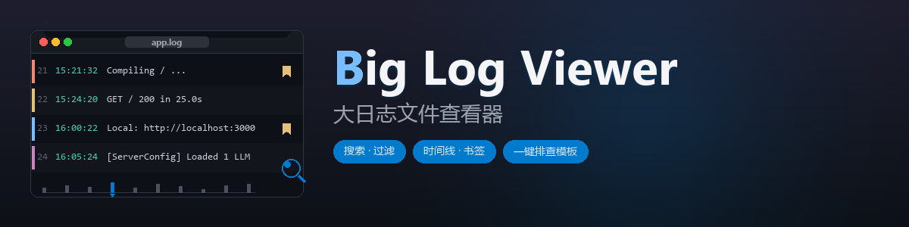
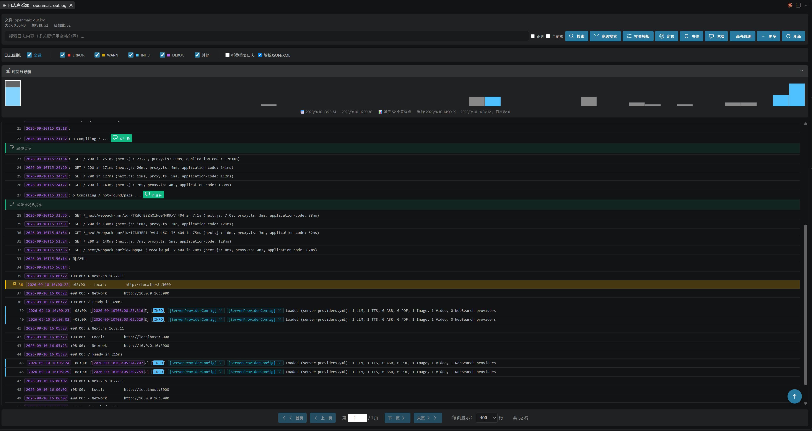
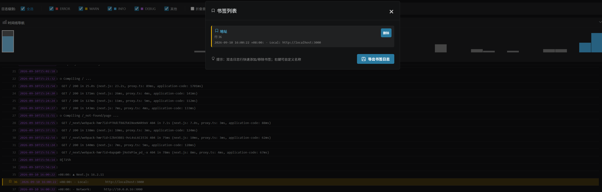
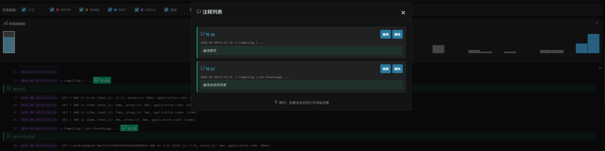
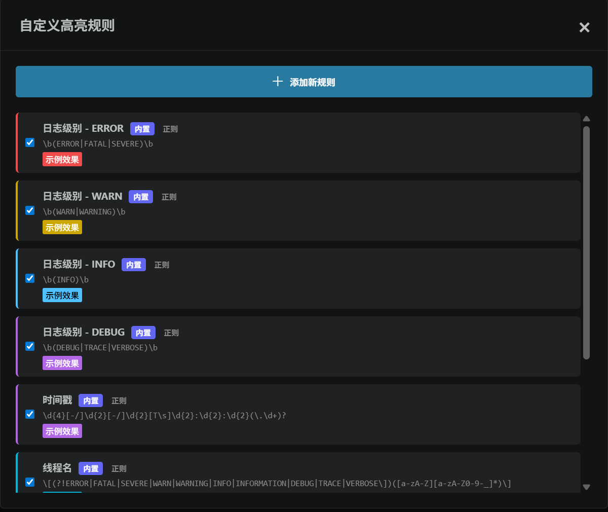
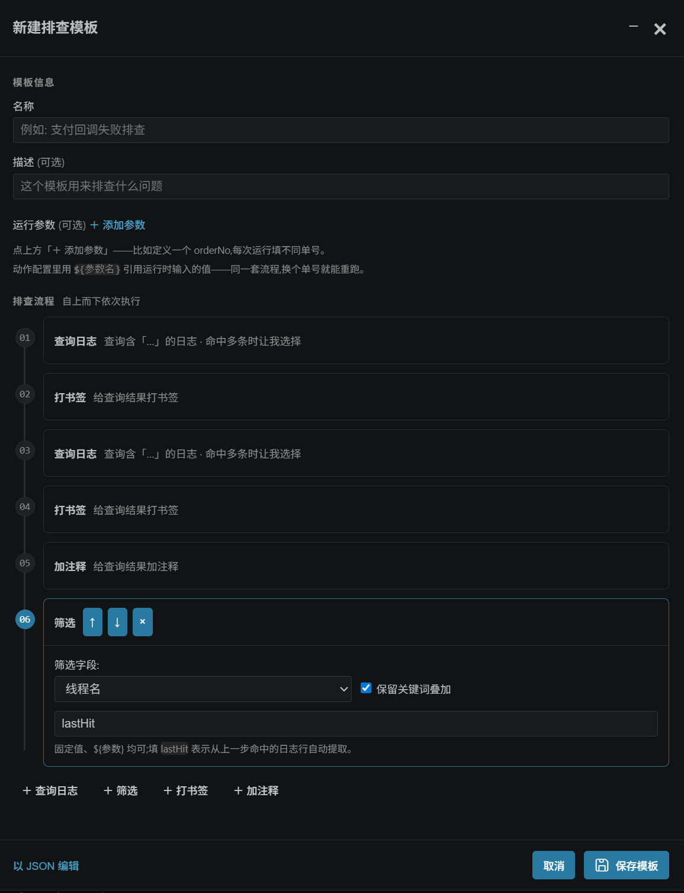

<a id="readme-top"></a>

<!-- 项目横幅与徽章 -->
<div align="center">



**GB 级日志文件，在 VSCode 里秒开、可搜、可标注、可一键排查**

[![Version][version-shield]][version-url]
[![License][license-shield]][license-url]
[![VSCode][vscode-shield]][vscode-url]
[![Stars][stars-shield]][stars-url]
[![Issues][issues-shield]][issues-url]

[安装](#快速开始) · [使用方法](#使用方法) · [命令面板](#命令面板) · [问题反馈][issues-url]

</div>

<!-- 目录 -->
<details>
  <summary>目录</summary>
  <ol>
    <li><a href="#关于项目">关于项目</a></li>
    <li><a href="#功能特性">功能特性</a></li>
    <li><a href="#界面预览">界面预览</a></li>
    <li><a href="#快速开始">快速开始</a></li>
    <li><a href="#使用方法">使用方法</a>
      <ul>
        <li><a href="#打开日志文件">打开日志文件</a></li>
        <li><a href="#搜索与过滤日志">搜索与过滤日志</a></li>
        <li><a href="#书签注释与高亮规则">书签、注释与高亮规则</a></li>
        <li><a href="#运行排查模板">运行排查模板</a></li>
        <li><a href="#时间线统计与导出">时间线、统计与导出</a></li>
        <li><a href="#日志裁剪">日志裁剪</a></li>
      </ul>
    </li>
    <li><a href="#配置">配置</a></li>
    <li><a href="#命令面板">命令面板</a></li>
    <li><a href="#主题">主题</a></li>
    <li><a href="#已知限制">已知限制</a></li>
    <li><a href="#本地开发">本地开发</a></li>
    <li><a href="#贡献">贡献</a></li>
    <li><a href="#许可证">许可证</a></li>
    <li><a href="#作者">作者</a></li>
  </ol>
</details>

## 关于项目

排查线上问题时要翻的服务器日志，经常几百 MB 起步，几个 GB 也不稀奇。用 VSCode 直接打开，轻则卡半天，重则直接拒绝。这个扩展给这类文件配了一个专用查看器：文件按流式读取，内存里只保留当前需要的数据，配合虚拟滚动，GB 级文件也能秒开，滚到哪加载到哪。

能打开之后，排查日志要用的工具它也配齐了：多关键词与正则搜索、线程和级别过滤、时间线导航、书签与注释，还有把固定排查流程存成一键重跑的排查模板。这类日志通常是从服务器单独下载的文件，不在任何项目工作区里，所以标注数据保存在用户级存储、模板分享走剪贴板或 JSON 文件，全程不依赖工作区。

<p align="right">(<a href="#readme-top">回到顶部</a>)</p>

## 功能特性

### 大文件加载

- GB 级文件秒开，虚拟滚动只渲染屏幕内的行，滚到哪加载到哪
- 文件读取全程流式，不把整个文件读进内存，多 GB 也不会撑爆扩展进程
- 加载时有真实进度（百分比、已读行数、当前阶段），不是转圈假动画
- 每页显示行数 50 到 1000 行可调
- 多个日志同时打开，各占一个独立面板，书签、注释、搜索状态互不干扰

### 搜索与过滤

- 多关键词用空格分隔就是 AND 匹配，比如搜 `error timeout`，两个词同时出现的行才是结果
- 勾「正则」切换正则模式，勾「当前页」只在当前显示的页内快速定位
- 全局搜索自动记入历史，重新聚焦搜索框就能一键重搜（上限 50 条，按文件隔离）
- 高级搜索是一个查询构建器：条件一行一个，行间「且/或」芯片切换整体逻辑，底部实时预览这次查询会做什么
- 搜索、线程名、类名、方法名、日志级别、时间范围全部叠加生效，「取消筛选」一键清空
- 连续重复的日志自动折叠（忽略时间戳差异），折叠徽标显示当前搜索的命中数

### 标注与导航

- 双击日志行加书签，右键可以给书签起名；书签行整行主题色高亮，书签列表里可一键导出书签日志
- 右键日志行添加注释，注释列表集中管理
- 内置 ERROR / WARN / INFO / DEBUG、时间戳、线程名高亮规则，也支持自定义正则规则
- 时间线导航把全文件按时间采样画成分布图，点哪跳哪，当前浏览位置高亮
- 统计面板给出总行数、各级别数量和时间范围

### 排查模板

- 固定排查流程存成模板，一键自动重跑，换个订单号或 traceId 就能复用
- 四种动作自由编排：查询日志、筛选、打书签、加注释，动作间自动传上下文（比如从命中行提取线程名接着筛）
- 命中多条时可配置「让我选择 / 保留全部 / 自动选第一条」，零命中时可配置终止或跳过继续
- 可视化与 JSON 双形式编辑，通过剪贴板或文件导入导出，方便分享给同事

### 界面与主题

- 级别配色、线程/类/方法标签、折叠徽标都跟随主题变量
- 四套主题：默认（跟随 VSCode）、NEON.CYBER、AURORA.GLASS、HOLO.PRISM，切换立即生效，不丢搜索状态和滚动位置

<p align="right">(<a href="#readme-top">回到顶部</a>)</p>

## 界面预览

主界面：时间线导航、级别过滤、搜索栏和书签行高亮在同一屏。

<div align="center">

</div>

书签和注释都从行上的右键菜单发起，列表集中管理：

<table>
  <tr>
    <td width="50%"></td>
    <td width="50%"></td>
  </tr>
  <tr>
    <td align="center">书签管理与导出</td>
    <td align="center">注释管理</td>
  </tr>
</table>

高亮规则和排查模板编辑器：

<table>
  <tr>
    <td width="50%"></td>
    <td width="50%"></td>
  </tr>
  <tr>
    <td align="center">自定义高亮规则</td>
    <td align="center">排查模板编辑器</td>
  </tr>
</table>

<p align="right">(<a href="#readme-top">回到顶部</a>)</p>

## 快速开始

### 环境要求

- VSCode 1.75 或更高版本

### 安装

在扩展面板搜索「Big Log Viewer」或「大日志文件查看器」安装，也可以直接执行：

```bash
code --install-extension wake.big-log-viewer
```

想从源码自己打包：

```bash
git clone https://github.com/uwakeme/large_log_check.git
cd large_log_check
npm install
npm run package
```

打包会在项目根目录生成一个 `.vsix` 文件，在扩展面板右上角「⋯ → 从 VSIX 安装」里选择它即可。

### 第一次使用

在资源管理器里右键任意 `.log` / `.txt` 文件，选择「打开大日志文件」。进度条走完就是完整日志，可以直接搜了。

<p align="right">(<a href="#readme-top">回到顶部</a>)</p>

## 使用方法

### 打开日志文件

三种方式：

1. 资源管理器中右键 `.log` / `.txt` 文件，选「打开大日志文件」
2. 打开文件后，点编辑器右上角的查看器图标
3. 命令面板（`Ctrl+Shift+P`）执行「日志查看器: 打开大日志文件」

每个文件在独立面板中打开，标题栏显示文件名；书签、注释、高亮规则、搜索状态都按面板隔离，关闭面板即释放资源。

### 搜索与过滤日志

搜索框支持多关键词，空格分隔就是 AND 匹配；停止输入约 0.4 秒后自动触发（防抖时间可配）。勾选「正则」切换正则模式，勾选「当前页」只在当前显示的页内定位。

> [!TIP]
> 想找报错但日志里到处都是 timeout，直接搜 `error timeout`，只有两个词都出现的行才是结果。

执行过的全局搜索会自动记入历史（上限 50 条，按文件隔离，仅当前会话有效）。重新聚焦搜索框即弹出历史下拉，点击条目会还原关键词和正则开关并重新搜索，也可以悬停单删或一键清空。

「高级搜索」是一个查询构建器：每个条件独占一行（字段 → 匹配方式 → 值），支持关键词、线程名、类名、方法名、日志级别和时间范围；条件行之间的「且/或」芯片决定整体逻辑，底部的查询预览用一句话实时描述当前查询。关闭弹窗不丢已填的条件，重开接着改，「清空」才重置。

所有过滤条件（搜索、线程名、类名、方法名、级别、时间范围）叠加生效，不会互相覆盖；「取消筛选」一键清空，恢复完整视图。勾选「折叠重复日志」可以把连续重复的行合并成一组（比较时忽略时间戳差异），点击折叠组展开明细，徽标会显示当前搜索的命中数。**搜索/筛选/取消筛选后分页会按结果重新计算（回到第 1 页）**——折叠模式下不会保留旧页数，避免出现「显示 N 页但部分页空白」的错位。**点击行首「跳转到完整日志」会同时退出折叠模式**——折叠语境下的页码语义对完整日志无意义。

<details>
<summary>支持自动识别的时间格式</summary>

- `2024-01-01 12:00:00` / `2024-01-01 12:00:00.123`
- `2024/01/01 12:00:00` / `2024/01/01 12:00:00.123`
- `[2024-01-01 12:00:00]` / `[2024-01-01 12:00:00.123]`
- `01-01-2024 12:00:00`
- `2024-01-01T12:00:00` / `2024-01-01T12:00:00.123Z`（ISO 8601）

</details>

日志里没有标准时间戳时，时间范围过滤、时间线和按时间删除功能不可用。

### 书签、注释与高亮规则

双击日志行快速添加书签，右键菜单可以给书签起名（比如「第一次执行」），留空则默认叫「行 N」。书签行整行高亮：底色加深、行首色条与级别色条并排显示，配色跟随主题自动适配。书签管理弹窗里点「导出书签日志」，所有带书签的行会按行号排序导出到新文件。

右键日志行添加注释，注释列表里可以编辑和删除，方便团队协作分析。

高亮规则内置了 ERROR / WARN / INFO / DEBUG、时间戳、线程名几条，全部用正则实现；在「高级搜索」旁的「高亮规则」入口里可以添加自己的规则，控制匹配模式和颜色。

「定位」按钮输入行号直接跳转；向下滚动后右下角会出现「回到顶部」按钮，按 `Home` 键回到第一页。

### 运行排查模板

排查模板把固定排查流程存成可复用的模板：模板 = 运行参数 + 自上而下执行的动作序列。入口在工具栏「排查模板」按钮。

运行时在模板列表点「运行」，填写模板里 `${参数}` 占位对应的值（比如业务单号），点「开始执行」。动作会依次自动执行，查到哪、筛到哪就自动定位到哪；执行中可随时停止，结束后给出摘要（书签数、注释数、筛选线程、定位行）。

| 动作 | 做什么 |
| --- | --- |
| 查询日志 | 按关键词搜索，支持 `${参数}` 占位；命中多条时可配置「让我选择 / 保留全部 / 自动选第一条」，零命中时可配置终止或跳过继续 |
| 筛选 | 按线程名、类名、方法名、级别、时间范围过滤；值可以是固定内容、`${参数}`，或 `lastHit`（从上一步命中的日志行自动提取线程名） |
| 打书签 | 对查询命中结果或当前视图的全部日志批量打书签 |
| 加注释 | 同打书签，批量添加注释内容 |

查询动作还有两个可选约束：「从上一步命中之后开始查」和「仅同线程日志」，组合起来可以表达「找上一条日志之后的下一处匹配」这类链式定位。

新建模板在可视化编辑器里编排动作即可，也可以切到 JSON 模式直接编辑，两种形式是同一份数据。模板通过剪贴板或 JSON 文件导入导出（按 id 去重合并），适合把排查套路分享给同事。

> [!NOTE]
> 模板需要日志完全加载后才能运行。模板数据保存在 webview 本地存储中，与当前机器的用户配置绑定，换机器请用导出/导入迁移。

编辑模板时点标题栏的「─」可以收起编辑器、边看日志边操作；复制日志内容后编辑器会自动弹回，直接粘贴就行。

### 时间线、统计与导出

时间线导航把整个文件按时间采样画成分布图，点击某个时间块直接跳到对应位置；翻页、跳转时高亮跟着走，随时知道自己在哪个时间段。采样密度可在设置里调（默认 200 个采样点）。

「统计」按钮给出总行数、各级别日志数量和时间范围。

「导出」把过滤/搜索后的结果导出到新文件；书签日志在书签管理弹窗里导出。

### 日志裁剪

> [!CAUTION]
> 裁剪和删除会直接修改原文件，且不可恢复。操作前务必备份重要日志。

「日志裁剪」支持四种方式：删除指定时间之前/之后的日志、删除指定行号之前/之后的日志、只保留时间范围内的日志、只保留行号范围内的日志。命令面板里的「按时间删除日志」「按行数删除日志」效果相同。

<p align="right">(<a href="#readme-top">回到顶部</a>)</p>

## 配置

| 配置项 | 默认值 | 说明 |
| --- | --- | --- |
| `big-log-viewer.theme` | `default` | 视觉主题，可选 `default` / `neon` / `aurora` / `holo` |
| `big-log-viewer.search.debounceMs` | `400` | 搜索框停止输入后自动触发搜索的延迟（毫秒） |
| `big-log-viewer.collapse.minRepeatCount` | `2` | 至少重复多少次的行才会被折叠 |
| `big-log-viewer.timeline.samplePoints` | `200` | 时间线采样点数量（20–1000），越大越精细但计算越慢 |
| `big-log-viewer.level.aliases` | 见下 | 日志级别别名映射。标准级别词（ERROR/FATAL/SEVERE/WARN/WARNING/INFO/INFORMATION/DEBUG/TRACE/VERBOSE）始终参与识别，此表只定义额外别名。单字符别名仅在「时间戳之后」与「[方括号]」两种形态参与识别，不参与裸词识别。配置变更需重新打开或刷新日志文件后生效 |

<p align="right">(<a href="#readme-top">回到顶部</a>)</p>

## 命令面板

| 命令 | 说明 |
| --- | --- |
| `日志查看器: 打开大日志文件` | 选择一个日志文件在查看器中打开 |
| `日志查看器: 高级搜索` | 打开查询构建器 |
| `日志查看器: 排查模板` | 打开排查模板管理 |
| `日志查看器: 书签管理` | 打开书签列表 |
| `日志查看器: 注释管理` | 打开注释列表 |
| `日志查看器: 跳转到行号` | 输入行号直接跳转 |
| `日志查看器: 显示日志统计` | 查看总行数、级别分布、时间范围 |
| `日志查看器: 刷新日志文件` | 重新读取文件（文件被外部更新后用） |
| `日志查看器: 按时间删除日志` | 直接修改原文件，慎用 |
| `日志查看器: 按行数删除日志` | 直接修改原文件，慎用 |

<p align="right">(<a href="#readme-top">回到顶部</a>)</p>

## 主题

四套主题在「⋯ 更多 → 设置」面板里切换，立即生效，不丢搜索状态和滚动位置；选择会写入 VSCode 用户配置，跨工作区保持一致。

| 主题 | 风格 |
| --- | --- |
| 默认（跟随 VSCode） | 跟随当前编辑器主题，适合日常使用 |
| NEON.CYBER | 纯黑底、霓虹青/品红/琥珀、扫描线与 CRT 暗角，夜间值守很搭 |
| AURORA.GLASS | 深蓝紫渐变、极光动效、毛玻璃，适合投屏演示 |
| HOLO.PRISM | 炭灰底、全息渐变描边，仪表盘质感 |

也可以写在 `settings.json` 里：

```json
{
  "big-log-viewer.theme": "neon"
}
```

<p align="right">(<a href="#readme-top">回到顶部</a>)</p>

## 已知限制

- 全局搜索要扫描整个文件，1GB 以上的文件会明显耗时
- 日志里没有标准时间戳时，时间范围过滤、时间线、按时间删除都不可用
- 折叠重复日志时总页数在后台异步计算，首次切换可能要等一下
- 搜索历史仅当前会话有效，关闭查看器即清空；排查模板跨会话保留，但绑定当前机器的用户配置

<p align="right">(<a href="#readme-top">回到顶部</a>)</p>

## 本地开发

环境要求：Node.js 18+、VSCode 1.75+。

| 命令 | 作用 |
| --- | --- |
| `npm install` | 安装依赖 |
| `npm run watch` | 监听编译，配合 `F5` 调试 |
| `npm run compile` | 编译到 `out/` |
| `npm run lint` | 对 `src/` 跑 ESLint |
| `npm test` | 编译并运行 `node:test` 单元测试 |
| `npm run package` | 打包生成 `.vsix` |

调试方式：VSCode 打开本项目，按 `F5` 启动扩展开发主机，在新窗口里打开一个大 `.log` 文件验证。`watch` 会自动编译，改完代码手动重载窗口即可。

<details>
<summary>项目结构</summary>

```text
large_log_check/
├── src/
│   ├── extension.ts        # 入口：命令注册与分发
│   ├── logViewerPanel.ts   # WebView 面板生命周期与消息桥接（每文件单例）
│   ├── logProcessor.ts     # 流式读写、统计、时间线采样、删除/裁剪
│   ├── logParser.ts        # 纯函数解析：时间戳/级别/类名/方法名/线程名
│   └── webview.html        # WebView HTML 骨架
├── media/
│   ├── webview.js          # WebView 前端逻辑：搜索、过滤、虚拟滚动、书签
│   ├── webview.css         # 默认主题样式
│   ├── themes.css          # NEON.CYBER / AURORA.GLASS / HOLO.PRISM 覆盖层
│   ├── investigationTemplates.js  # 排查模板：编辑器与流水线引擎
│   └── searchHistory.js    # 搜索历史
├── test/                   # node:test 单元测试
├── docs/                   # 功能设计文档
└── images/                 # README 配图
```

</details>

<p align="right">(<a href="#readme-top">回到顶部</a>)</p>

## 贡献

欢迎提 Issue 和 PR。仓库约定：新功能的 PR 要在同一个提交里更新 `README.md` 和 `CHANGELOG.md`，未发布的条目放在 CHANGELOG 顶部的 `## [Unreleased]` 下。

<p align="right">(<a href="#readme-top">回到顶部</a>)</p>

## 许可证

[MIT][license-url] © [@uwakeme](https://github.com/uwakeme)

<p align="right">(<a href="#readme-top">回到顶部</a>)</p>

## 作者

**wake** — [GitHub @uwakeme](https://github.com/uwakeme)

如果这个扩展帮你省下了翻日志的时间，去 [Marketplace 页面][marketplace-url]留个评价，或者给仓库点个 Star。

---

<div align="center">

<a href="#readme-top">回到顶部</a>

</div>

<!-- 链接与徽章定义 -->
[version-shield]: https://img.shields.io/github/v/tag/uwakeme/large_log_check?style=for-the-badge&logo=github&label=Version
[version-url]: https://github.com/uwakeme/large_log_check/releases
[vscode-shield]: https://img.shields.io/badge/VSCode-1.75%2B-007ACC?style=for-the-badge&logo=visualstudiocode&logoColor=white
[vscode-url]: https://code.visualstudio.com/
[license-shield]: https://img.shields.io/badge/license-MIT-green?style=for-the-badge
[license-url]: ./LICENSE
[stars-shield]: https://img.shields.io/github/stars/uwakeme/large_log_check?style=for-the-badge&logo=github&label=Stars
[stars-url]: https://github.com/uwakeme/large_log_check/stargazers
[issues-shield]: https://img.shields.io/github/issues/uwakeme/large_log_check?style=for-the-badge&logo=github&label=Issues
[issues-url]: https://github.com/uwakeme/large_log_check/issues
[marketplace-url]: https://marketplace.visualstudio.com/items?itemName=wake.big-log-viewer
